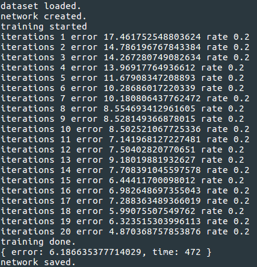

## MNIST.js

A simple neural network to classifier hand-written digits using MNIST dataset 
and synaptic.js library.

### Output

Due to low computational power, the network is trained on a smaller dataset.

### Network

The Network is saved as `./network.json`.